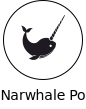

  

# I design and build AI-native product systems that connect strategy, workflow logic, and real-world impact.

 
With roots in architecture and years spent designing and coding complex product ecosystems, I’m drawn to the kind of work where structure, interaction, and implementation all need to make sense together. <b>My work is shaped by a hybrid mindset: part designer, part builder, part systems thinker</b>.
  

## Current Focus

 

<table border="0" cellspacing="0" cellpadding="20" align="center">
  <tr>
    <td align="center" width="20%"></td>
    <td align="center" width="20%"></td>
    <td align="center" width="20%"></td>
    <td align="center" width="20%"></td>
    <td align="center" width="20%"></td>
  </tr>
</table>

 

## Open Source

- [StackStorm / st2web](https://github.com/StackStorm/st2web)  
  UI design and frontend contribution work for the StackStorm web interface.

 

## Coming Soon

I am currently curating and polishing a selection of public repositories. More implementation-focused work, experiments, and interactive prototypes will be added here over time.
